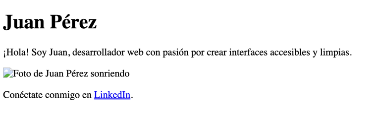

# Ejercicio 1: Página de Perfil Personal

Crea una vista HTML para un perfil personal. Debe incluir:

- Declaración `<!DOCTYPE html>` y estructura básica (`<html>`, `<head>`, `<body>`).
- En `<head>`, usa meta etiquetas `charset` y `viewport`, y un `<title>`.
- En `<body>`, añade:
    - Un `<header>` con un `<h1>` para el nombre.
    - Un párrafo `
` de presentación.
    - Una imagen `` con `src`, `alt`, `width`, `height`, `id` y `class`.
    - Un enlace `<a>` a tu página de LinkedIn (usa `href`, `target="_blank"`, `class`).

Aquí puedes ver un ejemplo de cómo podría lucir el resultado final (es un ejemplo, puedes personalizarlo):

