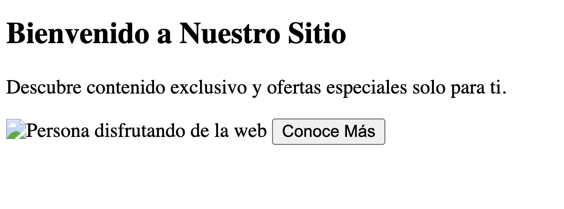

# Ejercicio 2: Sección Hero

Crea una vista HTML para un banner titulado "hero" en la página de inicio. Debe incluir:

- En `<head>`: meta etiquetas `charset` y `viewport`, y un `<title>`.  
- En `<body>`:
  - Un `<section>` con `id="hero"` y `class="hero-section"`.  
  - Dentro de la sección:
    - Un `<h1>` con `class="hero-title"`.  
    - Un `
` con `class="hero-description"`.  
    - Una imagen `` con `src`, `alt`, `width`, `height`, `id` y `class`.  
    - Un `<button>` con `id`, `class` y un atributo `title`.

Aquí puedes ver un ejemplo de cómo podría lucir el resultado final (es un ejemplo, puedes personalizarlo):

