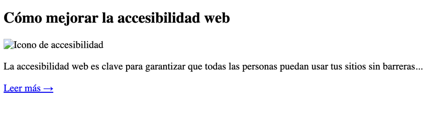

# Ejercicio 3: Vista Previa de Blog

Genera un fragmento HTML que muestre la vista previa de una entrada de blog. Debe incluir:

- En `<head>`: meta etiquetas `charset` y `viewport`, y un `<title>`.  
- En `<body>`:
  - Un `<article>` con `id="post-preview"` y `class="post-preview"`.  
  - Dentro del artículo:
    - Un `<h2>` con `class="post-title"`.  
    - Una imagen `` con `src`, `alt`, `width`, `height`, `id` y `class`.  
    - Un `
` con `class="post-excerpt"`.  
    - Un enlace `<a>` con `href`, `id`, `class` y `target="_blank"` para “Leer más”.

Aquí puedes ver un ejemplo de cómo podría lucir el resultado final (es un ejemplo, puedes personalizarlo):

