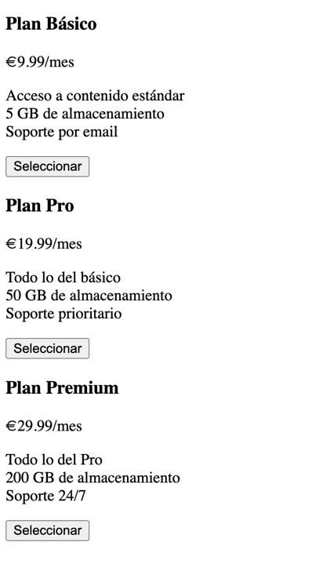

# Ejercicio 4: Tarjetas de Precios

Diseña una vista HTML con tres tarjetas de precios. Debe incluir:

- En `<head>`: meta etiquetas `charset`, `viewport` y `description`, y un `<title>`.  
- En `<body>`:
  - Un `<section>` con `id="pricing"` y `class="pricing-section"`.  
  - Dentro de la sección, tres `
` con `class="pricing-card"` y `id` distintos.
  - Cada tarjeta debe tener:
    - Un `<h3>` con `class="plan-name"`.  
    - Un `
` con `class="plan-price"`.  
    - Un `
` con `class="plan-details"` que use ` ` para separar líneas de texto.  
    - Un `<button>` con `id`, `class` y un atributo `title` (“Seleccionar plan”).

Aquí puedes ver un ejemplo de cómo podría lucir el resultado final (es un ejemplo, puedes personalizarlo):

