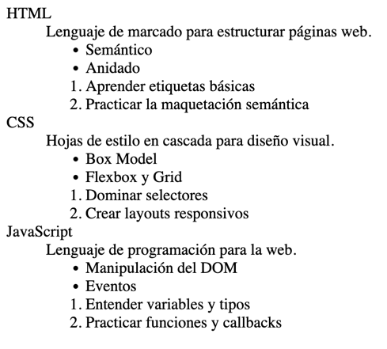

# Ejercicio 1: Glosario de Términos con Listas

Crea un glosario de tres términos de programación. Para cada término:

- Usa una **lista de definición** (`<dl>`), con `<dt>` para el término y `<dd>` para la definición.
- Dentro de cada `<dd>`, incluye una **lista no ordenada** (`<ul>`) con al menos dos características clave.
- A continuación, añade una **lista ordenada** (`<ol>`) con dos pasos recomendados para aprender ese término.

Aquí tienes un ejemplo de cómo podría lucir el resultado (aproximado, no es necesario que coincida exactamente):

