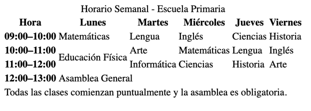

# Ejercicio 2: Calendario Escolar Semanal

Crea un calendario escolar de lunes a viernes con cuatro franjas horarias:

- Usa `<table>` con `<caption>`, `<colgroup>`/`<col>`, `<thead>`, `<tbody>` y `<tfoot>`.
- En la cabecera (`<thead>`) muestra “Hora” y los días de la semana.
- En las filas de `<tbody>`, pon:
  - Una materia por celda.
  - Una clase que abarque dos franjas usando `rowspan`.
  - Un evento especial que abarque todos los días usando `colspan`.
- En el pie (`<tfoot>`) añade una nota que ocupe todas las columnas.

Aquí tienes un ejemplo de cómo podría lucir el resultado (aproximado, no es necesario que coincida exactamente):

