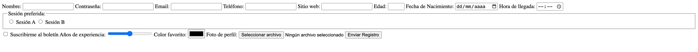

<!-- ejercicio_formularios.md -->
# Ejercicio 3: Formulario de Registro a Evento

Crea un formulario de registro para un evento de networking. Debe incluir al menos 7 tipos distintos de `<input>`:

- Texto (`text`)
- Contraseña (`password`)
- Email (`email`)
- Teléfono (`tel`)
- URL (`url`)
- Número (`number`)
- Fecha (`date`)
- Hora (`time`)
- Checkbox (`checkbox`)
- Radio (`radio`)
- Archivo (`file`)
- Color (`color`)
- Rango (`range`)

Usa `<label>` con `for`, `id` y `name`. Agrupa los radios en un `<fieldset>` con `<legend>`.

Aquí tienes un ejemplo de cómo podría lucir el resultado (aproximado, no es necesario que coincida exactamente):

